## **CLIProxyAPI反代教程，爽用大模型Api**

CLIProxyAPI使用会简单一些，兼容性也更好，主流龙虾都可以使用，教程以Windows为例上手难度较低，反代大模型Api使用

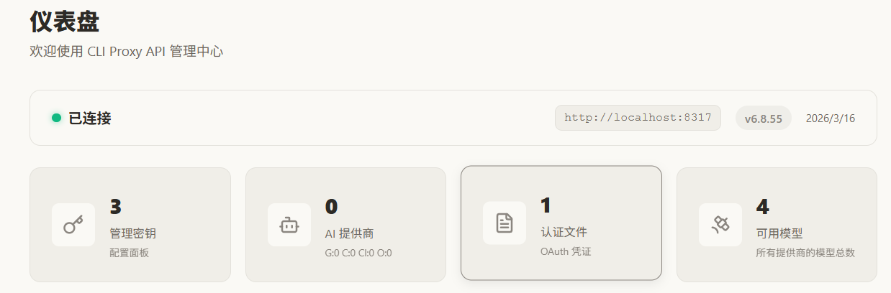

推荐Windows 服务器部署CLIProxyAPI，24小时不间断调用大模型Api

腾讯云新加坡，硅谷，东京地区价格是199元一年，2核4G30M带宽，60GBSSD盘 1.5T月流量

购买地址：https://curl.qcloud.com/oyWDLkRJ

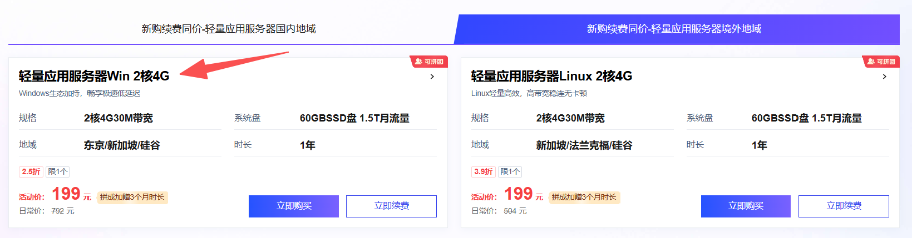

## **教程**

1.去下载项目，以Windows举例

地址：https://github.com/router-for-me/CLIProxyAPI/releases

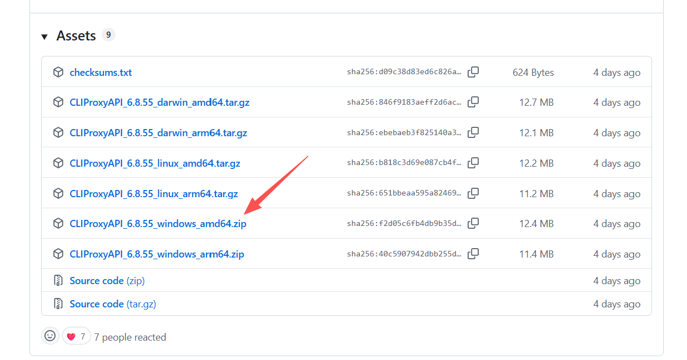

2.复制一份config.example.yaml重命名为config.yaml

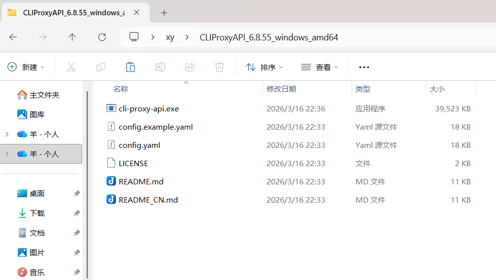

3.打开config.yaml，把allow-remote的false改为true，secret-key填入123456

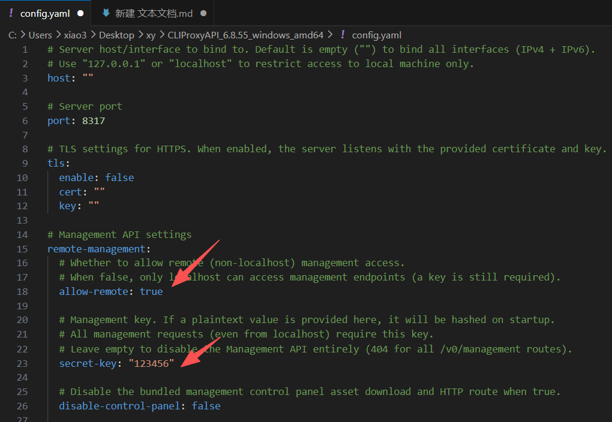

4.在项目文件夹运行命令

`./cli-proxy-api.exe`

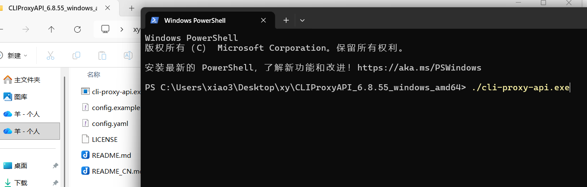

5.浏览器访问，输入密码123456

http://localhost:8317/management.html

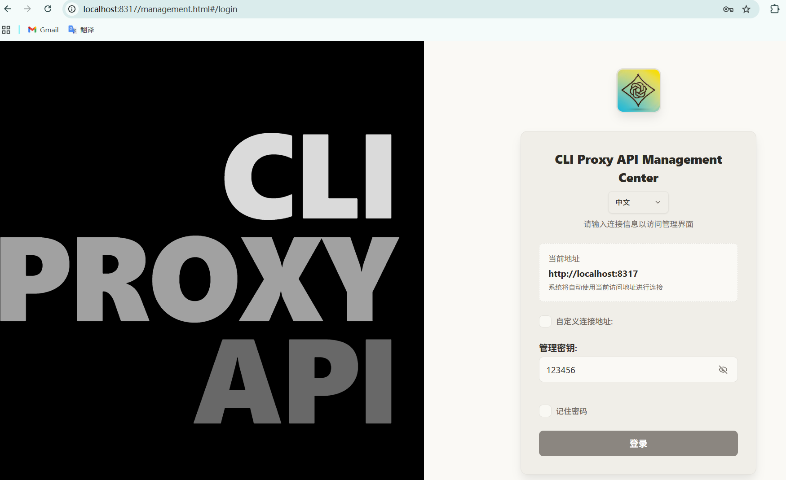

6.左侧找到OAuth 登录

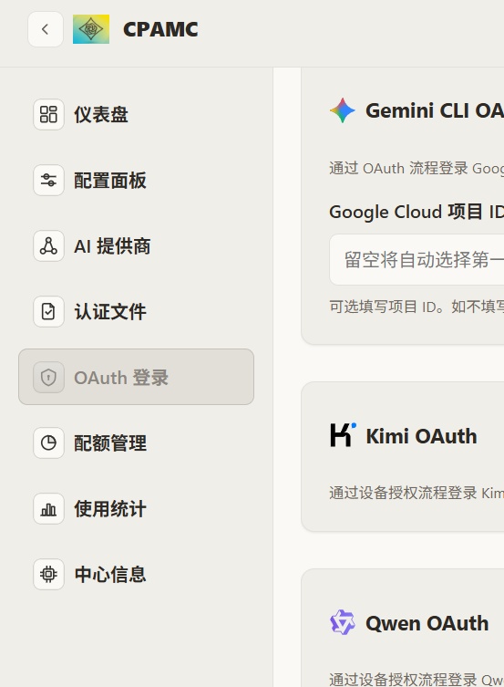

7.以qwen为例，点击登录后打开链接

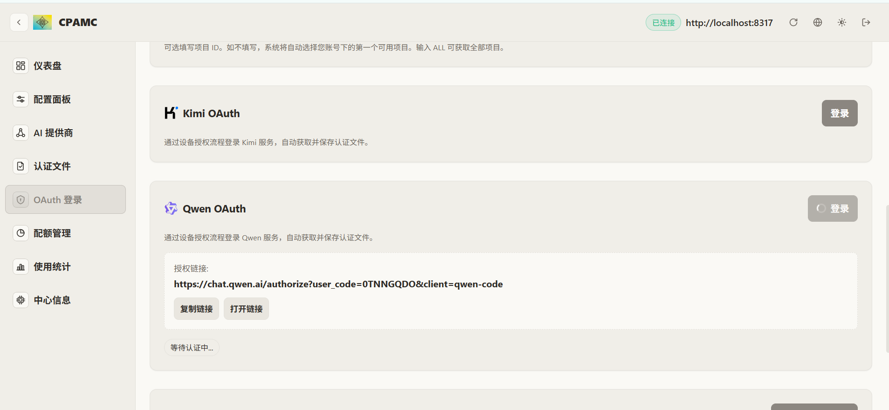

8.邮箱注册登录

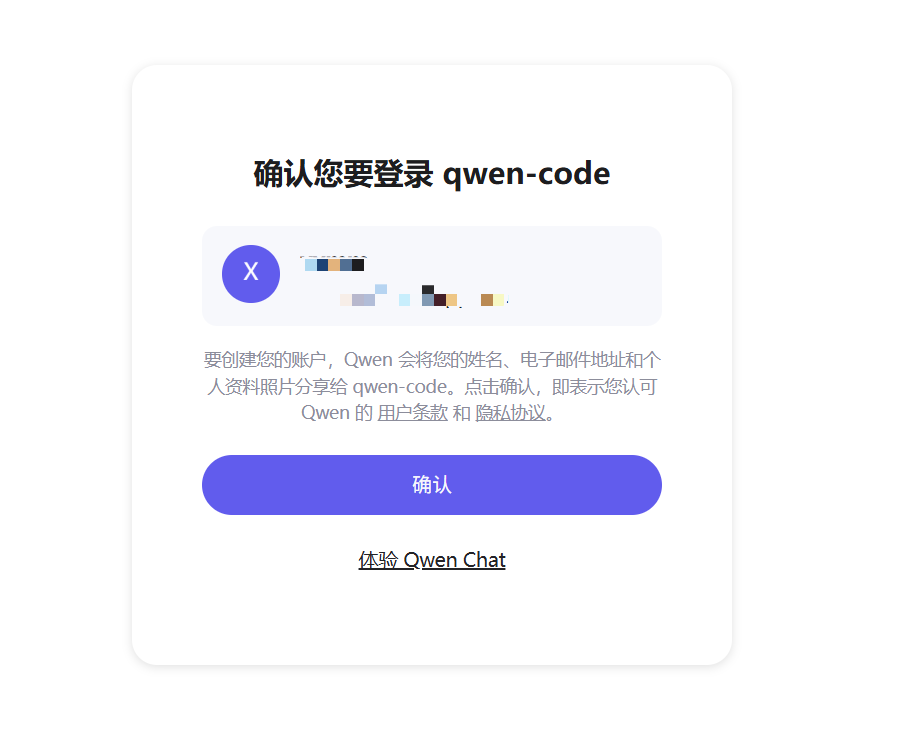

9.在信息中心，就是可以调用的模型了

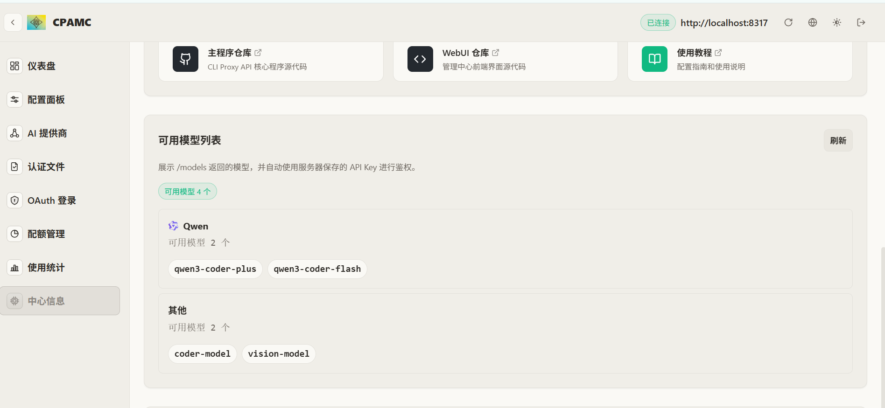

接口：http://localhost:8317/v1

模型：qwen3-coder-plus